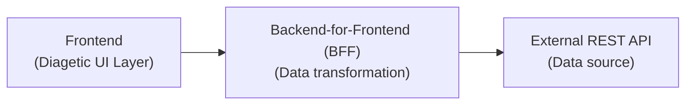
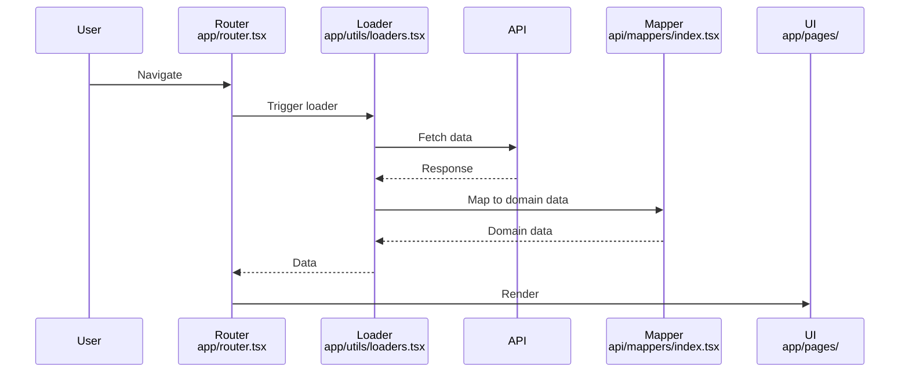
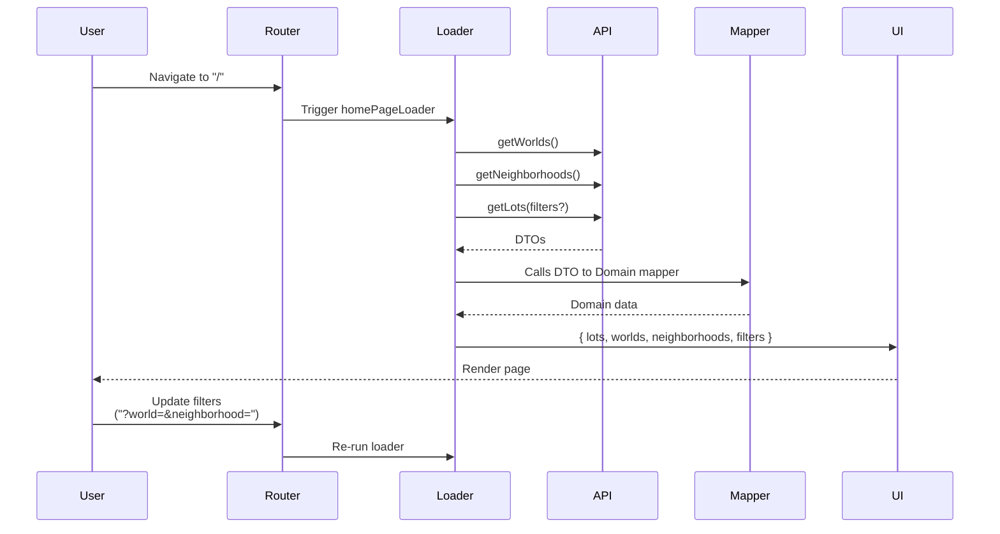
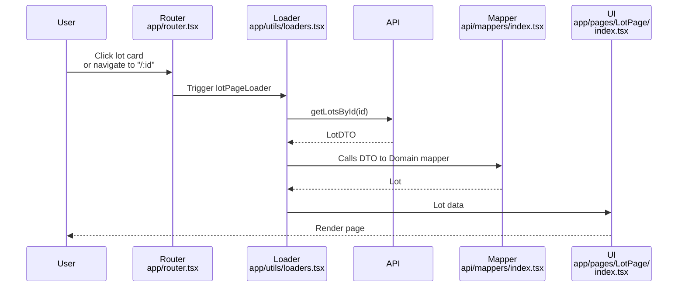

# Architecture

## 🌱 Overview

The application is structured into two main layers:

- **Frontend layer**
  - **Folder:** `app/` with pages, components, layouts
  - Diagetic UI Layer
- **Backend-for-frontend layer**
  - **Folder:** `api/` with request, mappers, DTOs, configs
  - Responsible for data transformation
  - Consumes data from the **Reactlot API**
    - Clone the [reactlots-api](https://github.com/lairaalmas/reactlots-api) project to run the backend service that provides data for this application.



## 📁 Folder Structure

```bash
.
├── app/          # Frontend layer 👈
│   ├── assets/         # Static assets (images, icons, etc.)
│   ├── components/     # Reusable UI components
│   ├── docs/           # Project documentation
│   ├── hooks/          # Custom React hooks
│   ├── layouts/        # Layout templates
│   ├── pages/          # Route-specific components
│   ├── types/          # TypeScript domain types
│   ├── utils/          # Utility functions
│   ├── main.tsx            # React entry point
│   ├── router.tsx          # Route definitions
│   └── style.css           # Global styles
├── api/          # Backend-for-Frontend layer 👈
│   ├── config/       # Environment config
│   ├── types/        # DTOs (API response schemas)
│   ├── requests/     # API call functions
│   ├── mappers/      # DTO → Domain type transformers (snake_case → camelCase)
│   └── mocks/        # Mocked data
├── index.html            # HTML entry point for Vite
├── README.md             # Main project documentation
├── LICENSE               # Project license
├── .env.example          # Environment variables template
├── .gitignore            # Files to be ignored by git
├── .nvmrc                # Node.js version specification
├── .prettierrc           # Prettier code formatting configuration
├── eslint.config.js      # ESLint configuration (flat config v9+)
├── package.json          # Project dependencies and npm scripts
├── package-lock.json     # Locked dependency versions
├── tsconfig.json         # TypeScript configuration (root reference)
├── tsconfig.app.json     # TypeScript config for app/ (client-side)
├── tsconfig.node.json    # TypeScript config for tooling (Node.js)
└── vite.config.ts        # Vite build tool configuration
```

## 🎯 Design Principles

- **Diegetic domain modeling** - concepts are adapted to the game universe instead of real-world conventions.
- **URL as source of truth** - search state is driven by query parameters, enabling predictable navigation.
- **Separation of concerns** - UI logic, data transformation and API communication are isolated. It helps with:
  - **Maintainability** - Changes to API schema only affect the mapper layes
  - **Reusability** - BFF layer can be shared across different frontends
- **Type Safety** - DTOs (Data Transfer Objects) map API schemas to domain types

  ```mermaid
  flowchart LR
    API["API Response"]
    Mapper["Mapper"]
    UI["UI"]

    API -->|DTO| Mapper -->|Domain data| UI
  ```

## 🎯 Key Design Patterns

- **Backend-for-Frontend (BFF) Pattern**
  - Dedicated `api/` layer handles all API communication
  - Decouples frontend UI from backend API schema
  - Single source of truth for API integration

- **DTO Mapping Pattern**
  - API responses use **snake_case** (`LotDTO type, lot_details, image_url`)
  - Frontend domain types use **camelCase** (`Lot type, lotDetails, imageUrl`)
  - Mappers provide clean transformation layer

- **Code Splitting and Lazy Loading**
  - Pages are code-split with `React.lazy()`
  - `PageContent` component uses `Suspense` for loading fallback
  - Improves initial page load performance

- **React Router Loaders**
  - Data fetching happens **before** component rendering
  - URL query params drive data fetching (e.g., `?world=willow-creek&neighborhood=foundry-cove`)

## 🔁 Routing and Loaders

**React Router** is responsible for both routing and data fetching. Loaders ensure data is available before rendering.



## 🔁 Specific Flows

#### Home page search flow



#### Lot detail page flow



## ⚖️ Trade-offs and Decisions

- **React Router loaders instead of React Query:** for simplicity and control
- **No generic API response wrapper:** simplifies early development
- **DTO vs Domain:** avoids leaking API structure into UI
- **Responsibility-based API structure:** improves scalability over domain-based grouping.
