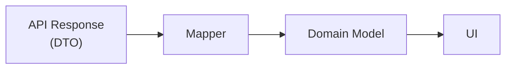

# Backend-for-frontend

The `api/` folder acts as a Backend-for-Frontend (BFF) layer inside the frontend.

It is responsible for isolating the UI from backend-specific concerns such as API contracts and data formats.

Responsibilities:

- fetching data from the backend API
- mapping DTO → domain models
- isolating backend changes from the UI layer

## 📂 Folder structure

```bash
api/
├── config/
│   └── env.ts              # Environment configuration (API_BASE_URL)
├── mappers/
│   ├── lot.ts              # Maps LotDTO to Lot (snake_case → camelCase)
│   ├── neighborhood.ts     # Maps NeighborhoodDTO to Neighborhood
│   └── world.ts            # Maps WorldDTO to World
├── mocks/
├── requests/
│   ├── getLots.ts          # Fetch lots (with optional filters) or lot by id
│   ├── getNeighborhoods.ts # Fetch all neighborhoods
│   └── getWorlds.ts        # Fetch all worlds
└── types/
    ├── lotDTO.ts
    ├── neighborhoodDTO.ts
    └── worldDTO.ts
```

🔄 Data Flow

Data flows through the BFF layer before reaching the UI. The UI never consumes DTOs directly.



## 🔗 Endpoints

The BFF layer consumes the following endpoints from the Reactlots API. For detailed information, see the [reactlots-api](https://github.com/lairaalmas/reactlots-api) repository.

### Lots

- **GET `/lots`** - Fetch all lots with optional filters
  - Query params (optional): `?world=willow-creek&neighborhood=foundry-cove`
  - Returns: `LotDTO[]`
  - Used for: searching lots

- **GET `/lots/:id`** - Fetch a single lot by ID
  - Path param (required): `id` (lot identifier)
  - Returns: `LotDTO`
  - Used for: rendering the lot detail page

### Neighborhoods

- **GET `/neighborhoods`** - Fetch all neighborhoods
  - Returns: `NeighborhoodDTO[]`
  - Used for: setting dropdown options in neighborhood filter

### Worlds

- **GET `/worlds`** - Fetch all worlds
  - Returns: `WorldDTO[]`
  - Used for: setting dropdown options in world filter

## 🧠 Key Principles

- The UI never consumes raw API responses
- All API interactions are centralized in `requests/`
- Data transformation happens in `mappers/`
- DTOs reflect backend contracts, while domain models - reflect UI needs
